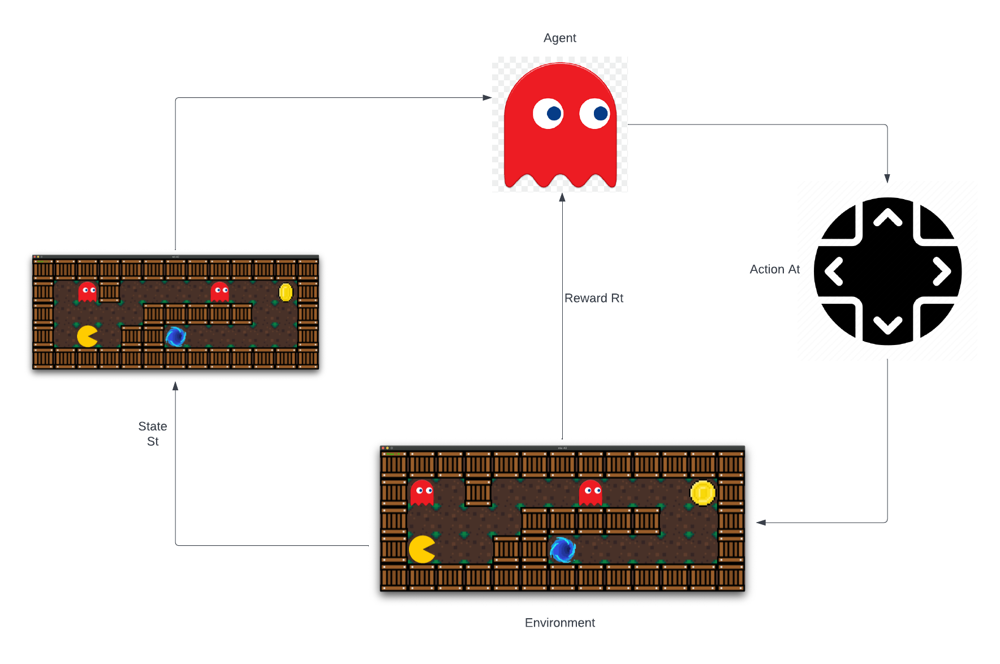

# so-long.

**This the 42 project so long but modified to be trained to behave artificially using various algorithms.**

This is a collaborating project with [Jerome-JJT](https://github.com/Jerome-JJT).

## Motivation:

The reinforcement learning is fun and quite fascinating.

### What it is?

The idea behind Reinforcement Learning is that an agent will learn from the environment by interacting with it and 
receiving rewards for performing actions.
Learning from interaction with the environment comes from our natural experiences.

## The idea:

We can perform reinforcement learning within a loop of `state, action, reward and next_state`. meaning we run the program
observe its states and actions then try to learn from the previous mistakes, the reward is given when the agent
does a well job, [-1] when things go wrong, [!+1] otherwise.

* Our Agent receives `state S0` from the `Environment(the game)`— we receive the first frame of our game.
* Based on that `state S0`,  the Agent takes `action A0`— our Agent will move.
* Environment goes to a new `state S1`— new frame.
* The environment gives some `reward R1` to the Agent — the player got a coin (Negative Reward -1).

## The expected return:

Catch the player.

### State:

## The reward hypothesis:

The central idea of Reinforcement Learning is to maximize the expected return.
That’s why in Reinforcement Learning, to have the best behavior,
we aim to learn to take actions that maximize the expected cumulative reward.

## Observations/States Space

Observations/States are the information our agent gets from the environment. In this game we have a complete state
as the map is completely visible from our perspective.

## Action Space

The Action space is the set of all possible actions in an environment. And we have a finite set of actions.

## Todo:

* Read and get the state.
* Prepare state and action classes.
